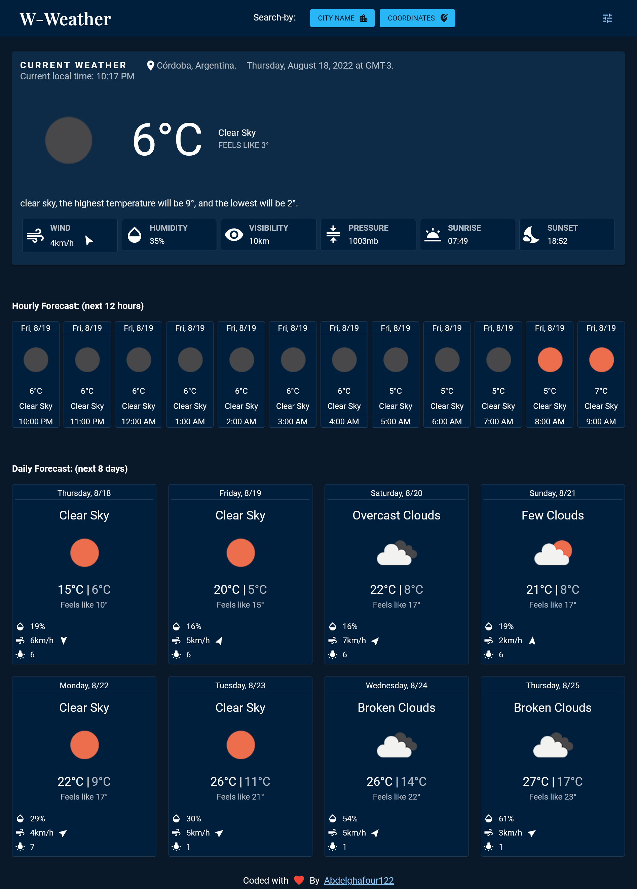
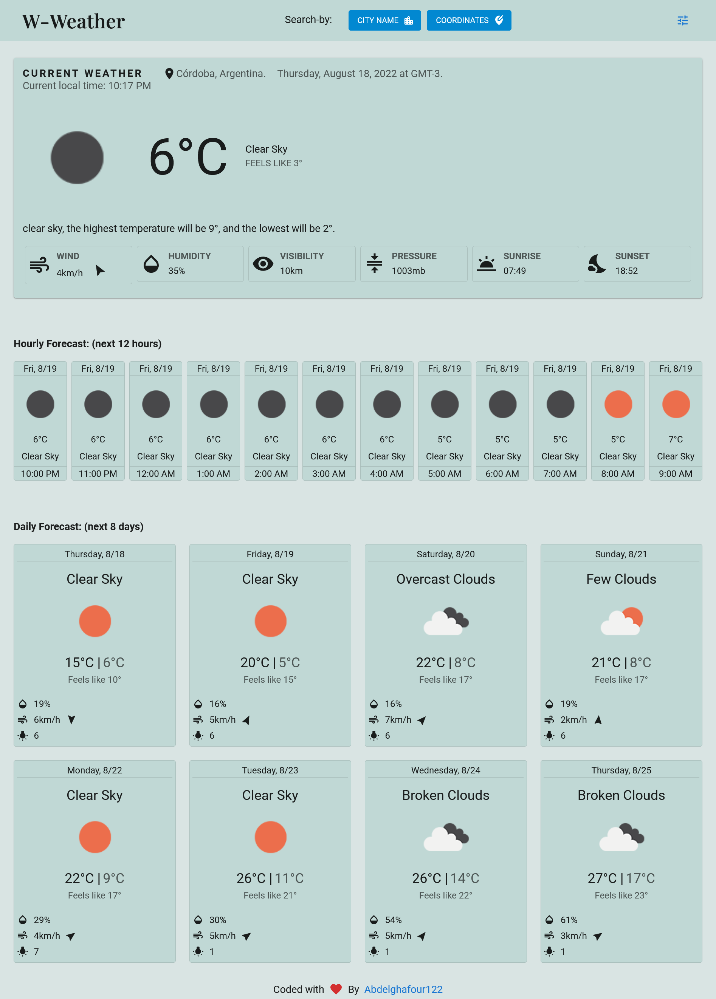
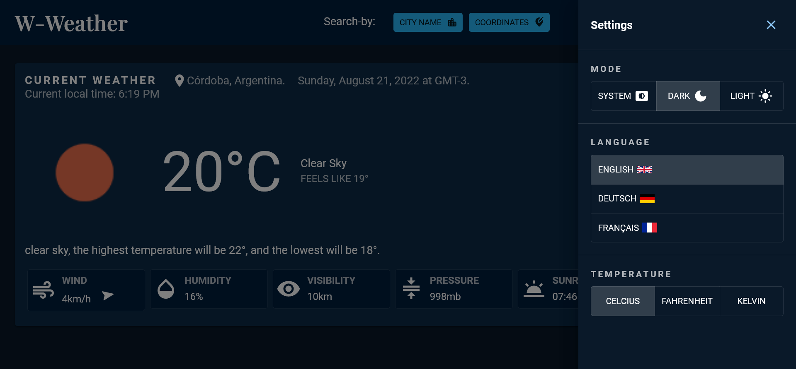
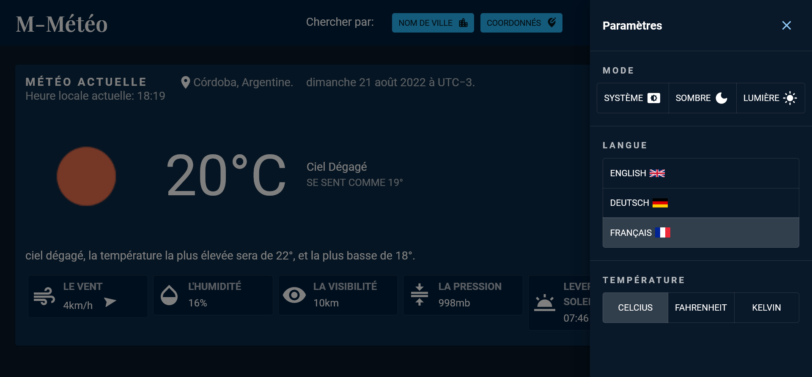
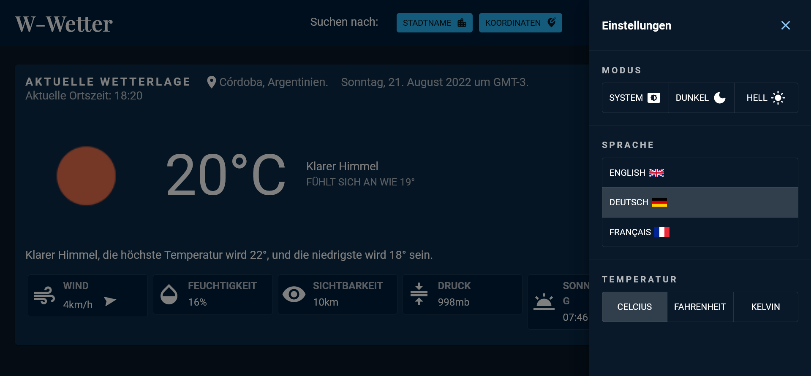
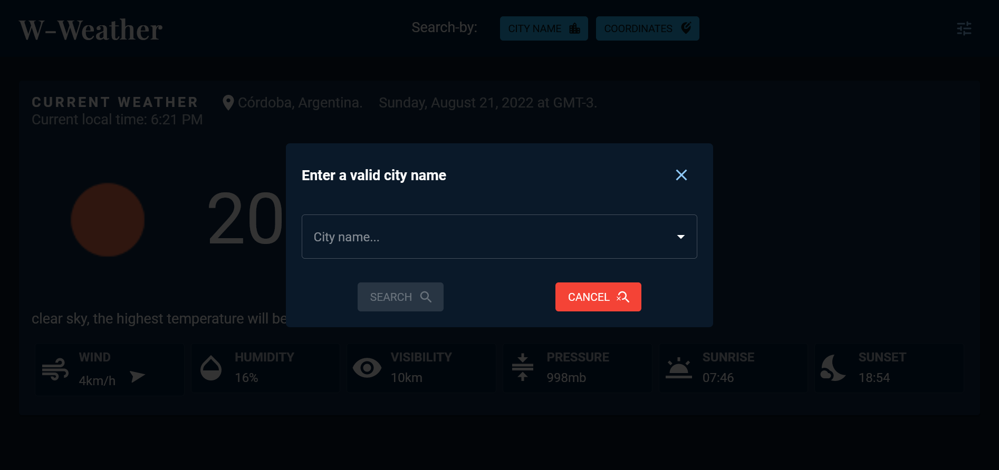
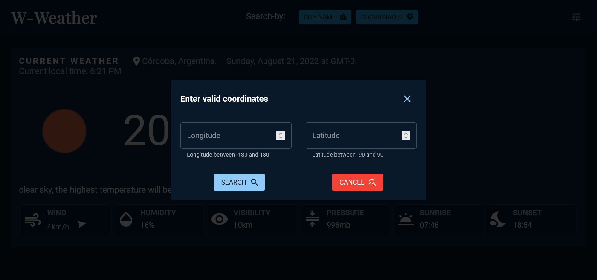

# W-Weather: Weather Forecast App

This is a Weather Forecast app made with React.js, MUI, SCSS using the OpenWeatherMap's api for the forecast data, & other apis for location data.

The forecast is by default in English & can be translated in French and German, i wanted to add Arabic but some apis do not support it.

The user should be able to:

- Search for a location by name or by coordinates.
- See the current, hourly & daily forecast of a specified location.
- See the forecast in three languages (french, english, german).
- Switch between measurement units (fahrenheit, celcius, kelvin).
- Switch between Light and Dark mode.

## Usage:

1. Clone the repository.
2. Run `pnpm install` to install the dependencies.
3. Get an API-KEY from [OpenWeatherMap.org](https://openweathermap.org/).
4. Make a `.env` file in the src folder & use your API-KEY as an environment variable.

## Resources:

- [React.js](https://reactjs.org/)
- [MUI](https://mui.com/)
- [i18next](https://react.i18next.com/)
- [OpenWeatherMap-Api](https://openweathermap.org/api)
- [GeoDB-Cities](https://rapidapi.com/wirefreethought/api/geodb-cities/details)
- [Ip-API](https://ip-api.com/)

## Screenshots

